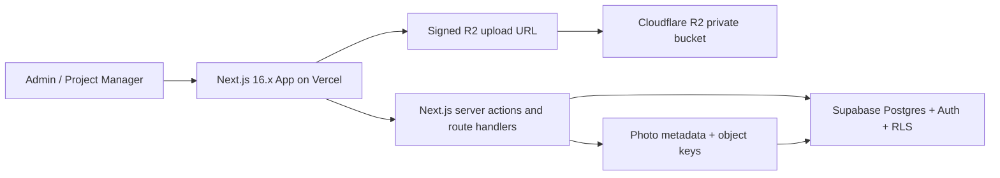

# Architecture

Source of truth: system shape for the fresh MVP. Product scope lives in `../DESIGN.md`; data shape lives in `DATA_MODEL.md`.

## MVP Architecture

## Components

| Component | MVP responsibility | Notes |
| --- | --- | --- |
| Next.js app | UI, routing, server rendering, forms, route handlers, server actions. | Use latest stable 16.x after deployment compatibility check; this baseline was verified against official docs on May 4, 2026. |
| Vercel | App hosting, preview deployments, production deployment. | One owner seat assumed; avoid media storage here. |
| Supabase Auth | Admin and PM authentication. | Client records are not auth users. |
| Supabase Postgres | Relational source of truth. | RLS is the authorization boundary. |
| Supabase RLS | Row-level permission enforcement. | Policies must be tested. |
| Cloudflare R2 | Private photo evidence object storage. | Use signed upload/view URLs. |
| Prototype fixture adapter | Seeded data behind backend-shaped interfaces. | Removed or swapped when backend is wired. |

## MVP Data Flow

1. User opens the Next.js app.
2. Supabase Auth identifies Admin or Project Manager.
3. UI calls backend-shaped functions from `API_CONTRACT.md`.
4. During prototype, those functions read/write seeded fixture state.
5. During production wiring, those functions call Next.js server actions or route handlers.
6. Server code reads/writes Supabase with RLS-aware behavior.
7. Photo upload requests get signed R2 URLs.
8. Browser uploads directly to R2.
9. Server records photo metadata and object keys in Supabase.
10. Audit events are written for sensitive changes.

## Future Offline Architecture

Offline sync is backlog. The MVP must not implement it, but must preserve future compatibility:

- Stable UUIDs for all entities.
- `created_at` and `updated_at` timestamps.
- Append-only audit events.
- Object-key-based photo metadata.
- Clear mutation contracts.
- Idempotency keys for future retryable actions.
- No UI component directly coupled to Supabase rows.

Future offline modules may include:

- WatermelonDB browser persistence.
- Go sync service.
- Delta pull/push endpoints.
- Local media queue.
- Conflict resolution by timestamp and role priority.

## Architecture Rules

- Do not proxy large photo uploads through Next.js.
- Do not expose service-role secrets to browser code.
- Do not use public R2 URLs for user photo evidence.
- Do not couple UI components directly to fixture files.
- Do not require offline behavior for MVP.
- Do not add Client app auth without a decision update.

## Definition Of Done

Architecture is ready for implementation when:

- Hosting, database, auth, and media boundaries are clear.
- Prototype and backend data flows use the same contract names.
- Security and audit flows are represented.
- Backlog modules can be added without replacing MVP contracts.
